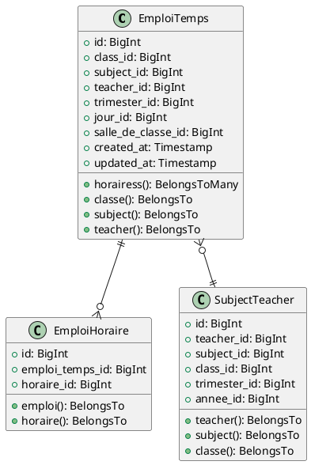
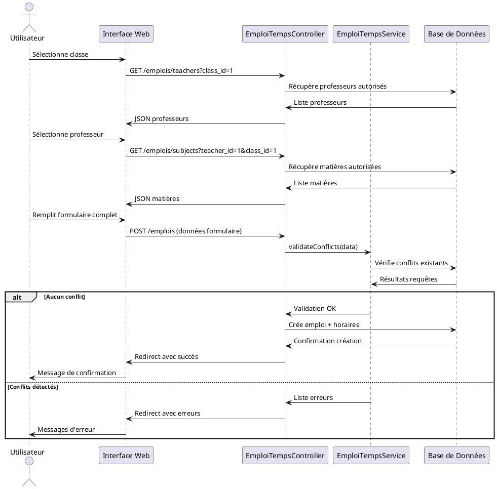

# CONCEPTION DU SYSTÈME DE GESTION DES EMPLOIS DU TEMPS

---

## 📋 INFORMATIONS GÉNÉRALES

**Titre du Projet** : Système de Gestion des Emplois du Temps  
**Version** : 1.0  
**Date** : Octobre 2024  
**Auteur** : Équipe Développement  
**Framework** : Laravel 11  
**Base de Données** : MySQL  

---

## 🎯 1. OBJECTIFS ET PORTÉE DU PROJET

### 1.1 Objectif Principal
Développer une application web complète permettant la gestion automatisée des emplois du temps dans les établissements d'enseignement supérieur, avec une prévention intelligente des conflits d'horaires et une interface utilisateur intuitive.

### 1.2 Objectifs Spécifiques
- **Gestion hiérarchique** des structures académiques (Départements → Spécialités → Classes)
- **Planification optimisée** des cours avec validation automatique des conflits
- **Association dynamique** professeurs-matières selon les contextes pédagogiques
- **Interface moderne** avec technologies web actuelles (Bootstrap 5, Select2, AJAX)
- **Localisation française** complète avec messages d'erreur explicites

### 1.3 Portée du Système
- **Utilisateurs cibles** : Administrateurs académiques, Secrétaires pédagogiques
- **Établissements** : Universités, Écoles supérieures, Instituts de formation
- **Périmètre fonctionnel** : Gestion complète des emplois du temps (création à impression)

---

## 🏗️ 2. ARCHITECTURE GÉNÉRALE DU SYSTÈME

### 2.1 Architecture Technique

#### Stack Technologique
```
Frontend : 
├── HTML5/CSS3
├── Bootstrap 5 (Framework UI)
├── jQuery 3.6+ (Manipulation DOM)
├── Select2 (Sélections avancées)
└── AJAX (Requêtes asynchrones)

Backend :
├── PHP 8.1+
├── Laravel 11 (Framework MVC)
├── Eloquent ORM (Gestion BDD)
└── Blade Templates (Moteur de vues)

Base de Données :
├── MySQL 5.7+
├── Relations complexes
├── Contraintes d'intégrité
└── Index optimisés
```

#### Modèle MVC Laravel
```
app/
├── Http/
│   ├── Controllers/
│   │   ├── EmploiTempsController.php
│   │   ├── SubjectTeacherController.php
│   │   ├── TeacherController.php
│   │   └── ClasseController.php
│   ├── Requests/
│   │   └── EmploiTempsRequest.php
│   └── Middleware/
├── Models/
│   ├── EmploiTemps.php
│   ├── EmploiHoraire.php
│   ├── SubjectTeacher.php
│   ├── Teacher.php
│   ├── Subject.php
│   ├── Classe.php
│   ├── Speciality.php
│   └── Horaire.php
└── Services/
    ├── EmploiTempsService.php
    └── ValidationService.php
```

### 2.2 Architecture Données

#### Hiérarchie Académique
```
Anneescolaire (Année Scolaire)
├── Trimester (Trimestre)
└── Departement (Département)
    └── Niveauformation (Niveau Formation)
        └── Speciality (Spécialité)
            ├── Classe (Classe)
            └── Subject (Matière)
```

#### Relations Opérationnelles
```
Teacher (Professeur) ←→ Subject (Matière)
    ↓ (via SubjectTeacher)
Classe (Contexte pédagogique)
    ↓
EmploiTemps (Emploi du temps)
    ↓ (relation many-to-many)
Horaire (Créneaux horaires multiples)
```

---

## 📊 3. CONCEPTION DE LA BASE DE DONNÉES

### 3.1 Modèle Conceptuel de Données (MCD)

#### Entités Principales

**ANNEESCOLAIRE**
- `id` : Identifiant unique
- `annee_debut` : Année de début
- `annee_fin` : Année de fin
- `active` : Statut d'activation
- `created_at`, `updated_at` : Timestamps

**DEPARTEMENT**
- `id` : Identifiant unique
- `nom` : Nom du département
- `description` : Description détaillée
- `created_at`, `updated_at` : Timestamps

**NIVEAUFORMATION**
- `id` : Identifiant unique
- `nom` : Nom du niveau (L1, L2, M1...)
- `ordre` : Ordre de classement
- `created_at`, `updated_at` : Timestamps

**SPECIALITY**
- `id` : Identifiant unique
- `nom` : Nom de la spécialité
- `departement_id` : Référence département
- `niveauformation_id` : Référence niveau
- `created_at`, `updated_at` : Timestamps

**CLASSE**
- `id` : Identifiant unique
- `nom` : Nom de la classe
- `speciality_id` : Référence spécialité
- `niveau_pedagogique_id` : Référence niveau pédagogique
- `created_at`, `updated_at` : Timestamps

**TEACHER**
- `id` : Identifiant unique
- `name` : Nom complet
- `email` : Email professionnel
- `telephone` : Numéro de téléphone
- `created_at`, `updated_at` : Timestamps

**SUBJECT**
- `id` : Identifiant unique
- `name` : Nom de la matière
- `code` : Code matière
- `speciality_id` : Référence spécialité
- `created_at`, `updated_at` : Timestamps

**TRIMESTER**
- `id` : Identifiant unique
- `name` : Nom du trimestre
- `annee_id` : Référence année scolaire
- `date_debut` : Date de début
- `date_fin` : Date de fin
- `created_at`, `updated_at` : Timestamps

**HORAIRE**
- `id` : Identifiant unique
- `libelle_fr` : Libellé français
- `libelle_ar` : Libellé arabe
- `start_time` : Heure de début
- `end_time` : Heure de fin
- `ordre` : Ordre de classement
- `created_at`, `updated_at` : Timestamps

**JOUR**
- `id` : Identifiant unique
- `nom` : Nom du jour
- `ordre` : Ordre dans la semaine
- `created_at`, `updated_at` : Timestamps

**SALLE_DE_CLASSE**
- `id` : Identifiant unique
- `nom` : Nom de la salle
- `capacite` : Capacité d'accueil
- `equipement` : Description équipements
- `created_at`, `updated_at` : Timestamps

### 3.2 Tables de Liaison et Associations

**SUBJECT_TEACHER** (Association Professeur-Matière)
- `id` : Identifiant unique
- `teacher_id` : Référence professeur
- `subject_id` : Référence matière
- `class_id` : Référence classe (CONTEXTE)
- `trimester_id` : Référence trimestre
- `annee_id` : Référence année scolaire
- `created_at`, `updated_at` : Timestamps

**EMPLOIS_TEMPS** (Emploi du Temps Principal)
- `id` : Identifiant unique
- `class_id` : Référence classe
- `subject_id` : Référence matière
- `teacher_id` : Référence professeur
- `trimester_id` : Référence trimestre
- `annee_id` : Référence année scolaire
- `jour_id` : Référence jour
- `salle_de_classe_id` : Référence salle (optionnel)
- `created_at`, `updated_at` : Timestamps

**EMPLOI_HORAIRE** (Horaires Multiples)
- `id` : Identifiant unique
- `emploi_temps_id` : Référence emploi du temps
- `horaire_id` : Référence horaire
- `created_at`, `updated_at` : Timestamps

### 3.3 Contraintes d'Intégrité

#### Clés Étrangères
```sql
ALTER TABLE specialities ADD CONSTRAINT fk_speciality_departement 
FOREIGN KEY (departement_id) REFERENCES departements(id) ON DELETE CASCADE;

ALTER TABLE classes ADD CONSTRAINT fk_classe_speciality 
FOREIGN KEY (speciality_id) REFERENCES specialities(id) ON DELETE CASCADE;

ALTER TABLE subject_teacher ADD CONSTRAINT fk_st_teacher 
FOREIGN KEY (teacher_id) REFERENCES teachers(id) ON DELETE CASCADE;

ALTER TABLE emplois_temps ADD CONSTRAINT fk_emploi_classe 
FOREIGN KEY (class_id) REFERENCES classes(id) ON DELETE CASCADE;

ALTER TABLE emploi_horaire ADD CONSTRAINT fk_emploi_horaire 
FOREIGN KEY (emploi_temps_id) REFERENCES emplois_temps(id) ON DELETE CASCADE;
```

#### Index de Performance
```sql
CREATE INDEX idx_subject_teacher_lookup ON subject_teacher 
(class_id, trimester_id, annee_id);

CREATE INDEX idx_emploi_temps_search ON emplois_temps 
(class_id, trimester_id, jour_id);

CREATE INDEX idx_emploi_horaire_emploi ON emploi_horaire 
(emploi_temps_id);

CREATE INDEX idx_conflict_detection ON emplois_temps 
(teacher_id, jour_id, trimester_id);
```

#### Contraintes Uniques
```sql
ALTER TABLE subject_teacher ADD CONSTRAINT uk_subject_teacher_context 
UNIQUE (teacher_id, subject_id, class_id, trimester_id);

ALTER TABLE emploi_horaire ADD CONSTRAINT uk_emploi_horaire 
UNIQUE (emploi_temps_id, horaire_id);
```

---

## 🔧 4. CONCEPTION FONCTIONNELLE

### 4.1 Diagrammes de Cas d'Usage

#### Acteurs Principaux
- **Administrateur Académique** : Gestion complète du système
- **Secrétaire Pédagogique** : Saisie et modification des emplois du temps
- **Professeur** : Consultation de ses emplois (futur)
- **Étudiant** : Consultation emplois de classe (futur)

#### Cas d'Usage Principaux

**CU01 : Configurer Structure Académique**
- Acteur : Administrateur
- Description : Créer départements, spécialités, classes
- Préconditions : Droits d'administration
- Postconditions : Structure créée et validée

**CU02 : Gérer Professeurs et Matières**
- Acteur : Administrateur
- Description : Ajouter professeurs, matières, associations
- Préconditions : Structure académique existante
- Postconditions : Personnel et matières opérationnels

**CU03 : Créer Emploi du Temps**
- Acteur : Secrétaire Pédagogique
- Description : Planifier cours avec validation automatique
- Préconditions : Configuration complète
- Postconditions : Emploi du temps validé et sauvegardé

**CU04 : Valider Conflits d'Horaires**
- Acteur : Système
- Description : Vérification automatique des conflits
- Préconditions : Données emploi saisies
- Postconditions : Validation réussie ou erreurs détectées

### 4.2 Workflow de Création d'Emploi du Temps

```
1. Sélection Classe
   ↓
2. Auto-chargement Trimestre Actif
   ↓
3. Filtrage Professeurs Disponibles
   (via subject_teacher + contexte classe)
   ↓
4. Sélection Professeur
   ↓
5. Auto-filtrage Matières Autorisées
   (selon associations professeur-classe)
   ↓
6. Sélection Matière, Jour, Horaires
   ↓
7. Validation Conflits Multi-niveaux
   - Professeur disponible ?
   - Salle libre ?
   - Classe libre ?
   ↓
8. Sauvegarde ou Correction Erreurs
```

### 4.3 Règles de Gestion Métier

#### Règles de Validation des Conflits

**RG01 : Unicité Professeur-Horaire**
- Un professeur ne peut enseigner qu'une seule matière par créneau horaire
- Vérification : `(teacher_id, jour_id, horaire_id, trimester_id) = UNIQUE`

**RG02 : Unicité Salle-Horaire**
- Une salle ne peut accueillir qu'un seul cours par créneau
- Vérification : `(salle_id, jour_id, horaire_id, trimester_id) = UNIQUE`

**RG03 : Unicité Classe-Horaire**
- Une classe ne peut avoir qu'un cours par créneau
- Vérification : `(class_id, jour_id, horaire_id, trimester_id) = UNIQUE`

**RG04 : Cohérence Pédagogique**
- Le professeur doit être autorisé à enseigner la matière pour cette classe
- Vérification : Existence dans `subject_teacher` avec contexte complet

**RG05 : Contraintes Temporelles**
- Les emplois du temps sont créés pour le trimestre actif
- Horaires multiples possibles pour un même cours
- Respect de l'ordre chronologique des créneaux

#### Règles de Configuration

**RC01 : Ordre de Configuration**
1. Années scolaires → Activer année courante
2. Structure académique (Départements → Spécialités → Classes)
3. Personnel (Professeurs, Matières)
4. Associations (Professeur-Matière par classe)
5. Configuration temporelle (Trimestres, Jours, Horaires)
6. Création emplois du temps

**RC02 : Validation des Associations**
- Association professeur-matière obligatoire avant création emploi
- Contexte classe + trimestre requis pour association
- Validation des compétences pédagogiques

---

## 💻 5. CONCEPTION DE L'INTERFACE UTILISATEUR

### 5.1 Principes de Design

#### Ergonomie et Accessibilité
- **Design responsive** : Bootstrap 5 pour adaptation multi-écrans
- **Interface intuitive** : Navigation claire et logique
- **Feedback visuel** : Messages d'erreur et de confirmation explicites
- **Localisation** : Interface entièrement en français

#### Standards UX/UI
- **Cohérence visuelle** : Charte graphique uniforme
- **Temps de réponse** : Chargement AJAX pour fluidité
- **Validation temps réel** : Retour immédiat sur les erreurs
- **Assistance contextuelle** : Messages d'aide intégrés

### 5.2 Architecture des Vues

#### Structure des Templates Blade
```
resources/views/
├── layouts/
│   ├── masters/
│   │   └── master.blade.php          # Template principal
│   └── components/
│       ├── sidebar.blade.php         # Navigation latérale
│       └── header.blade.php          # En-tête
├── admin/
│   ├── emplois/
│   │   ├── index.blade.php           # Liste emplois
│   │   ├── create.blade.php          # Formulaire création
│   │   └── edit.blade.php            # Formulaire modification
│   ├── sct_emplois_temps/
│   │   └── pdf/
│   │       └── classe_emplois_pdf.blade.php  # Export PDF
│   └── partials/
│       ├── form_emploi.blade.php     # Formulaire dynamique
│       └── validation_errors.blade.php  # Affichage erreurs
└── components/
    ├── select2.blade.php             # Composant Select2
    └── datatable.blade.php           # Tableaux dynamiques
```

#### Composants JavaScript
```javascript
// Fonctionnalités principales
class EmploiTempsManager {
    // Gestion formulaire dynamique
    addRow()
    removeRow()
    
    // Chargement AJAX
    loadTeachers(classId, trimesterId)
    loadSubjects(teacherId, classId)
    
    // Validation temps réel
    validateConflicts()
    displayErrors()
    
    // Interface Select2
    initializeSelect2()
    updateOptions()
}
```

### 5.3 Formulaires et Interactions

#### Formulaire Principal de Création
```html
<form id="emploi-form" action="{{ route('web.emplois.store') }}" method="POST">
    <!-- Sélection classe (contexte principal) -->
    <select name="class_id" id="class_id" class="form-control" required>
        <option value="">Sélectionner une classe</option>
        @foreach($classes as $classe)
            <option value="{{ $classe->id }}">{{ $classe->nom }}</option>
        @endforeach
    </select>
    
    <!-- Trimestre (auto-sélectionné selon année active) -->
    <select name="trimester_id" id="trimester_id" class="form-control" required>
        <!-- Options chargées dynamiquement -->
    </select>
    
    <!-- Lignes dynamiques pour chaque cours -->
    <div id="cours-container">
        <div class="cours-row">
            <!-- Professeur (filtré par classe) -->
            <select name="teacher_id[]" class="teacher-select" required>
                <!-- Chargé via AJAX selon classe -->
            </select>
            
            <!-- Matière (filtrée par professeur + classe) -->
            <select name="subject_id[]" class="subject-select" required>
                <!-- Chargé via AJAX selon professeur/classe -->
            </select>
            
            <!-- Jour -->
            <select name="jour_id[]" class="form-control" required>
                @foreach($jours as $jour)
                    <option value="{{ $jour->id }}">{{ $jour->nom }}</option>
                @endforeach
            </select>
            
            <!-- Horaires multiples (Select2) -->
            <select name="horaire_id[][]" class="horaire-select" multiple required>
                @foreach($horaires as $horaire)
                    <option value="{{ $horaire->id }}">{{ $horaire->libelle_fr }}</option>
                @endforeach
            </select>
            
            <!-- Salle (optionnel) -->
            <select name="salle_de_classe_id[]" class="form-control">
                <option value="">Sélectionner une salle (optionnel)</option>
                @foreach($salles as $salle)
                    <option value="{{ $salle->id }}">{{ $salle->nom }}</option>
                @endforeach
            </select>
        </div>
    </div>
    
    <!-- Boutons d'action -->
    <button type="button" id="add-cours" class="btn btn-secondary">
        <i class="fa fa-plus"></i> Ajouter un cours
    </button>
    <button type="submit" class="btn btn-primary">
        <i class="fa fa-save"></i> Enregistrer l'emploi du temps
    </button>
</form>
```

#### Interactions AJAX
```javascript
// Chargement professeurs selon classe
$('#class_id').on('change', function() {
    let classId = $(this).val();
    let trimesterId = $('#trimester_id').val();
    
    if (classId && trimesterId) {
        $.ajax({
            url: '/admin/emplois/teachers',
            data: { class_id: classId, trimester_id: trimesterId },
            success: function(data) {
                $('.teacher-select').html(data.html);
                $('.subject-select').html('<option value="">Sélectionner un professeur d\'abord</option>');
            }
        });
    }
});

// Chargement matières selon professeur
$(document).on('change', '.teacher-select', function() {
    let teacherId = $(this).val();
    let classId = $('#class_id').val();
    let subjectSelect = $(this).closest('.cours-row').find('.subject-select');
    
    if (teacherId && classId) {
        $.ajax({
            url: '/admin/emplois/subjects',
            data: { teacher_id: teacherId, class_id: classId },
            success: function(data) {
                subjectSelect.html(data.html);
            }
        });
    }
});
```

---

## 🔒 6. SÉCURITÉ ET VALIDATION

### 6.1 Validation des Données

#### Validation Backend (Laravel)
```php
// EmploiTempsRequest - Règles de validation
public function rules()
{
    return [
        'class_id' => 'required|exists:classes,id',
        'trimester_id' => 'required|exists:trimesters,id',
        'teacher_id.*' => 'required|exists:teachers,id',
        'subject_id.*' => 'required|exists:subjects,id',
        'jour_id.*' => 'required|exists:jours,id',
        'horaire_id.*.*' => 'required|exists:sct_ref_horaires,id',
        'salle_de_classe_id.*' => 'nullable|exists:salle_de_classes,id',
    ];
}

// Messages d'erreur personnalisés
public function messages()
{
    return [
        'class_id.required' => 'La classe est obligatoire',
        'teacher_id.*.exists' => 'Professeur sélectionné invalide',
        'horaire_id.*.*.required' => 'Au moins un horaire doit être sélectionné',
        // ...
    ];
}
```

#### Validation Métier Complexe
```php
// EmploiTempsService - Validation des conflits
public function validateConflicts($data)
{
    $errors = [];
    
    foreach ($data['teacher_id'] as $index => $teacherId) {
        $jourId = $data['jour_id'][$index];
        $horaireIds = $data['horaire_id'][$index];
        
        foreach ($horaireIds as $horaireId) {
            // Conflit professeur
            $conflictProf = $this->checkTeacherConflict($teacherId, $jourId, $horaireId, $data['trimester_id']);
            if ($conflictProf) {
                $errors[] = "Conflit professeur détecté : {$conflictProf->message}";
            }
            
            // Conflit salle
            if ($data['salle_de_classe_id'][$index]) {
                $conflictSalle = $this->checkSalleConflict($data['salle_de_classe_id'][$index], $jourId, $horaireId, $data['trimester_id']);
                if ($conflictSalle) {
                    $errors[] = "Conflit salle détecté : {$conflictSalle->message}";
                }
            }
            
            // Conflit classe
            $conflictClasse = $this->checkClasseConflict($data['class_id'], $jourId, $horaireId, $data['trimester_id']);
            if ($conflictClasse) {
                $errors[] = "Conflit classe détecté : {$conflictClasse->message}";
            }
        }
        
        // Validation association professeur-matière
        $validAssociation = $this->checkSubjectTeacherAssociation($teacherId, $data['subject_id'][$index], $data['class_id'], $data['trimester_id']);
        if (!$validAssociation) {
            $errors[] = "Association professeur-matière non autorisée pour cette classe";
        }
    }
    
    return $errors;
}
```

### 6.2 Sécurité des Accès

#### Middleware d'Authentification
```php
// Routes protégées
Route::middleware(['auth', 'admin'])->prefix('admin')->name('web.')->group(function () {
    Route::resource('emplois', EmploiTempsController::class);
    Route::get('emplois/teachers', [EmploiTempsController::class, 'getTeachers']);
    Route::get('emplois/subjects', [EmploiTempsController::class, 'getSubjects']);
});
```

#### Protection CSRF
```html
<!-- Formulaires protégés -->
<form method="POST" action="{{ route('web.emplois.store') }}">
    @csrf
    <!-- Contenu formulaire -->
</form>
```

#### Validation des Entrées
```php
// Sanitization des données
public function store(EmploiTempsRequest $request)
{
    // Données déjà validées par le Request
    $validatedData = $request->validated();
    
    // Validation métier supplémentaire
    $conflicts = $this->emploiService->validateConflicts($validatedData);
    
    if (!empty($conflicts)) {
        return back()->withErrors($conflicts)->withInput();
    }
    
    // Sauvegarde sécurisée
    DB::transaction(function () use ($validatedData) {
        $this->emploiService->createEmploi($validatedData);
    });
    
    return redirect()->route('web.emplois.index')->with('success', 'Emploi du temps créé avec succès');
}
```

---

## 📈 7. PERFORMANCES ET OPTIMISATION

### 7.1 Optimisation Base de Données

#### Stratégie d'Indexation
```sql
-- Index composites pour requêtes fréquentes
CREATE INDEX idx_emploi_context ON emplois_temps 
(class_id, trimester_id, annee_id);

CREATE INDEX idx_subject_teacher_context ON subject_teacher 
(class_id, trimester_id, teacher_id, subject_id);

CREATE INDEX idx_conflict_detection ON emplois_temps 
(teacher_id, jour_id, trimester_id);

-- Index pour recherches de conflits
CREATE INDEX idx_salle_planning ON emplois_temps 
(salle_de_classe_id, jour_id, trimester_id);
```

#### Requêtes Optimisées
```php
// Chargement optimisé avec relations
public function getEmploisWithDetails($classId, $trimesterId)
{
    return EmploiTemps::with([
        'classe:id,nom',
        'subject:id,name',
        'teacher:id,name',
        'trimester:id,name',
        'jour:id,nom,ordre',
        'horairess:id,libelle_fr,start_time,end_time',
        'salleDeClasse:id,nom'
    ])
    ->where('class_id', $classId)
    ->where('trimester_id', $trimesterId)
    ->orderBy('jour_id')
    ->get();
}

// Validation de conflits optimisée
public function checkTeacherConflict($teacherId, $jourId, $horaireId, $trimesterId)
{
    return EmploiTemps::whereHas('horairess', function($query) use ($horaireId) {
        $query->where('sct_ref_horaires.id', $horaireId);
    })
    ->where('teacher_id', $teacherId)
    ->where('jour_id', $jourId)
    ->where('trimester_id', $trimesterId)
    ->with(['subject:id,name', 'classe:id,nom'])
    ->first();
}
```

### 7.2 Optimisation Frontend

#### Chargement AJAX Optimisé
```javascript
// Cache des données fréquemment utilisées
class DataCache {
    constructor() {
        this.teachers = new Map();
        this.subjects = new Map();
    }
    
    getTeachers(classId, trimesterId) {
        const key = `${classId}-${trimesterId}`;
        if (this.teachers.has(key)) {
            return Promise.resolve(this.teachers.get(key));
        }
        
        return $.ajax({
            url: '/admin/emplois/teachers',
            data: { class_id: classId, trimester_id: trimesterId }
        }).then(data => {
            this.teachers.set(key, data);
            return data;
        });
    }
}

// Debounce pour les requêtes fréquentes
const debouncedValidation = debounce(validateForm, 300);

function debounce(func, wait) {
    let timeout;
    return function executedFunction(...args) {
        const later = () => {
            clearTimeout(timeout);
            func(...args);
        };
        clearTimeout(timeout);
        timeout = setTimeout(later, wait);
    };
}
```

#### Optimisation Select2
```javascript
// Configuration Select2 optimisée
$('.horaire-select').select2({
    theme: 'bootstrap-5',
    placeholder: 'Sélectionner les horaires',
    allowClear: true,
    closeOnSelect: false,
    templateResult: formatHoraireOption,
    templateSelection: formatHoraireSelection
});

function formatHoraireOption(horaire) {
    if (!horaire.id) return horaire.text;
    
    return $(`
        <span class="horaire-option">
            <strong>${horaire.text}</strong>
            <small class="text-muted">(${horaire.element.dataset.time})</small>
        </span>
    `);
}
```

---

## 🧪 8. TESTS ET QUALITÉ

### 8.1 Stratégie de Tests

#### Tests Unitaires (PHPUnit)
```php
// Tests des modèles
class EmploiTempsTest extends TestCase
{
    use RefreshDatabase;
    
    public function test_emploi_temps_creation()
    {
        $emploi = EmploiTemps::factory()->create();
        
        $this->assertDatabaseHas('emplois_temps', [
            'id' => $emploi->id,
            'class_id' => $emploi->class_id,
            'teacher_id' => $emploi->teacher_id
        ]);
    }
    
    public function test_teacher_conflict_validation()
    {
        // Créer un emploi du temps existant
        $existingEmploi = EmploiTemps::factory()->create([
            'teacher_id' => 1,
            'jour_id' => 1,
            'trimester_id' => 1
        ]);
        
        // Ajouter un horaire
        $existingEmploi->horairess()->attach(1);
        
        // Tenter de créer un conflit
        $service = new EmploiTempsService();
        $conflicts = $service->checkTeacherConflict(1, 1, 1, 1);
        
        $this->assertNotNull($conflicts);
    }
}

// Tests des contrôleurs
class EmploiTempsControllerTest extends TestCase
{
    public function test_create_emploi_with_valid_data()
    {
        $response = $this->post(route('web.emplois.store'), [
            'class_id' => 1,
            'trimester_id' => 1,
            'teacher_id' => [1],
            'subject_id' => [1],
            'jour_id' => [1],
            'horaire_id' => [[1, 2]]
        ]);
        
        $response->assertRedirect(route('web.emplois.index'));
        $response->assertSessionHas('success');
    }
    
    public function test_create_emploi_with_conflict()
    {
        // Créer un emploi existant
        EmploiTemps::factory()->create()->horairess()->attach(1);
        
        $response = $this->post(route('web.emplois.store'), [
            // Même données (conflit)
        ]);
        
        $response->assertSessionHasErrors();
    }
}
```

#### Tests d'Intégration
```php
// Test du workflow complet
class EmploiTempsWorkflowTest extends TestCase
{
    public function test_complete_emploi_creation_workflow()
    {
        // 1. Créer structure académique
        $departement = Departement::factory()->create();
        $speciality = Speciality::factory()->create(['departement_id' => $departement->id]);
        $classe = Classe::factory()->create(['speciality_id' => $speciality->id]);
        
        // 2. Créer professeurs et matières
        $teacher = Teacher::factory()->create();
        $subject = Subject::factory()->create(['speciality_id' => $speciality->id]);
        
        // 3. Créer association professeur-matière
        SubjectTeacher::factory()->create([
            'teacher_id' => $teacher->id,
            'subject_id' => $subject->id,
            'class_id' => $classe->id
        ]);
        
        // 4. Test création emploi du temps
        $response = $this->post(route('web.emplois.store'), [
            'class_id' => $classe->id,
            'teacher_id' => [$teacher->id],
            'subject_id' => [$subject->id],
            // ... autres données
        ]);
        
        // 5. Vérifications
        $response->assertSuccessful();
        $this->assertDatabaseHas('emplois_temps', ['class_id' => $classe->id]);
        $this->assertDatabaseHas('emploi_horaire', ['emploi_temps_id' => 1]);
    }
}
```

### 8.2 Tests Frontend (JavaScript)

#### Tests Unitaires JavaScript
```javascript
// Tests des fonctions utilitaires
describe('EmploiTempsManager', () => {
    let manager;
    
    beforeEach(() => {
        manager = new EmploiTempsManager();
        document.body.innerHTML = '<form id="emploi-form"></form>';
    });
    
    test('should add new course row', () => {
        manager.addRow();
        const rows = document.querySelectorAll('.cours-row');
        expect(rows.length).toBe(1);
    });
    
    test('should validate conflicts correctly', async () => {
        const formData = {
            teacher_id: [1],
            jour_id: [1],
            horaire_id: [[1, 2]]
        };
        
        const conflicts = await manager.validateConflicts(formData);
        expect(conflicts).toBeDefined();
    });
});

// Tests d'intégration AJAX
describe('AJAX Integration', () => {
    test('should load teachers for selected class', async () => {
        const mockResponse = {
            success: true,
            html: '<option value="1">Prof 1</option>'
        };
        
        jest.spyOn(global, 'fetch').mockResolvedValue({
            ok: true,
            json: () => Promise.resolve(mockResponse)
        });
        
        const result = await loadTeachers(1, 1);
        expect(result.success).toBe(true);
    });
});
```

### 8.3 Tests de Performance

#### Tests de Charge
```php
// Test de performance des requêtes
class PerformanceTest extends TestCase
{
    public function test_emploi_loading_performance()
    {
        // Créer données de test volumineuses
        Emploi::factory(1000)->create();
        
        $startTime = microtime(true);
        
        $emplois = EmploiTemps::with(['classe', 'teacher', 'subject', 'horairess'])
                             ->limit(100)
                             ->get();
        
        $executionTime = microtime(true) - $startTime;
        
        $this->assertLessThan(0.1, $executionTime); // Moins de 100ms
        $this->assertCount(100, $emplois);
    }
    
    public function test_conflict_detection_performance()
    {
        $service = new EmploiTempsService();
        
        $startTime = microtime(true);
        
        $conflicts = $service->checkAllConflicts(1, 1, 1, 1);
        
        $executionTime = microtime(true) - $startTime;
        
        $this->assertLessThan(0.05, $executionTime); // Moins de 50ms
    }
}
```

---

## 📦 9. DÉPLOIEMENT ET MAINTENANCE

### 9.1 Environnements

#### Configuration des Environnements
```bash
# Développement
APP_ENV=local
APP_DEBUG=true
DB_CONNECTION=mysql
DB_HOST=127.0.0.1
DB_DATABASE=gestion_emplois_dev

# Test
APP_ENV=testing
APP_DEBUG=true
DB_CONNECTION=sqlite
DB_DATABASE=:memory:

# Production
APP_ENV=production
APP_DEBUG=false
DB_CONNECTION=mysql
DB_HOST=production-server
DB_DATABASE=gestion_emplois_prod
```

#### Scripts de Déploiement
```bash
#!/bin/bash
# deploy.sh

echo "🚀 Déploiement Système Gestion Emplois du Temps"

# Mise à jour code
git pull origin main

# Dependencies
composer install --no-dev --optimize-autoloader
npm ci --only=production

# Base de données
php artisan migrate --force

# Cache et optimisations
php artisan config:cache
php artisan route:cache
php artisan view:cache
php artisan optimize

# Assets
npm run build

# Permissions
chown -R www-data:www-data storage bootstrap/cache
chmod -R 755 storage bootstrap/cache

echo "✅ Déploiement terminé avec succès"
```

### 9.2 Monitoring et Logs

#### Configuration Logs Laravel
```php
// config/logging.php
'channels' => [
    'emplois' => [
        'driver' => 'daily',
        'path' => storage_path('logs/emplois.log'),
        'level' => 'info',
        'days' => 14,
    ],
    
    'conflicts' => [
        'driver' => 'daily',
        'path' => storage_path('logs/conflicts.log'),
        'level' => 'warning',
        'days' => 30,
    ],
];
```

#### Logging Applicatif
```php
// EmploiTempsController
public function store(Request $request)
{
    Log::channel('emplois')->info('Création emploi du temps', [
        'user_id' => auth()->id(),
        'class_id' => $request->class_id,
        'data' => $request->all()
    ]);
    
    try {
        $emploi = $this->emploiService->createEmploi($request->validated());
        
        Log::channel('emplois')->info('Emploi du temps créé', [
            'emploi_id' => $emploi->id,
            'success' => true
        ]);
        
    } catch (ConflictException $e) {
        Log::channel('conflicts')->warning('Conflit détecté', [
            'error' => $e->getMessage(),
            'data' => $request->all()
        ]);
        
        throw $e;
    }
}
```

### 9.3 Maintenance et Évolutions

#### Tâches de Maintenance
```php
// app/Console/Commands/MaintenanceEmplois.php
class MaintenanceEmplois extends Command
{
    protected $signature = 'emplois:maintenance';
    protected $description = 'Maintenance système emplois du temps';
    
    public function handle()
    {
        $this->info('🔧 Début maintenance emplois du temps');
        
        // Nettoyage emplois anciens trimestres
        $this->cleanOldEmplois();
        
        // Vérification intégrité données
        $this->checkDataIntegrity();
        
        // Optimisation base de données
        $this->optimizeDatabase();
        
        $this->info('✅ Maintenance terminée');
    }
    
    private function cleanOldEmplois()
    {
        $deleted = EmploiTemps::whereHas('trimester', function($query) {
            $query->where('date_fin', '<', now()->subYear());
        })->delete();
        
        $this->info("🗑️  {$deleted} anciens emplois supprimés");
    }
    
    private function checkDataIntegrity()
    {
        $orphans = EmploiTemps::whereNotExists(function($query) {
            $query->select(DB::raw(1))
                  ->from('subject_teacher')
                  ->whereRaw('subject_teacher.teacher_id = emplois_temps.teacher_id')
                  ->whereRaw('subject_teacher.subject_id = emplois_temps.subject_id')
                  ->whereRaw('subject_teacher.class_id = emplois_temps.class_id');
        })->count();
        
        if ($orphans > 0) {
            $this->warn("⚠️  {$orphans} emplois sans association professeur-matière valide");
        }
    }
}
```

#### Évolutions Prévues
```markdown
# Roadmap Évolutions

## Version 1.1 (Q1 2025)
- [ ] Gestion des salles avec contraintes d'équipement
- [ ] Export emplois format Excel
- [ ] Notifications par email aux professeurs
- [ ] Interface mobile native

## Version 1.2 (Q2 2025)
- [ ] Planification automatique par algorithme
- [ ] Gestion des remplacements de professeurs
- [ ] Statistiques et rapports avancés
- [ ] API REST pour intégrations externes

## Version 2.0 (Q3 2025)
- [ ] Multi-établissements
- [ ] Gestion des évaluations et examens
- [ ] Module de présence et retards
- [ ] Interface étudiants avec authentification
```

---

## 📚 10. ANNEXES

### 10.1 Glossaire Technique

**AJAX** : Asynchronous JavaScript And XML - Technique permettant des requêtes asynchrones  
**Blade** : Moteur de templates de Laravel  
**Bootstrap** : Framework CSS pour interfaces responsives  
**Eloquent** : ORM (Object-Relational Mapping) de Laravel  
**Laravel** : Framework PHP MVC  
**MCD** : Modèle Conceptuel de Données  
**MVC** : Model-View-Controller (architecture logicielle)  
**ORM** : Object-Relational Mapping  
**Select2** : Plugin jQuery pour sélections avancées  

### 10.2 Références Techniques

#### Documentation Laravel
- [Laravel 11 Documentation](https://laravel.com/docs/11.x)
- [Eloquent ORM](https://laravel.com/docs/11.x/eloquent)
- [Blade Templates](https://laravel.com/docs/11.x/blade)
- [Validation](https://laravel.com/docs/11.x/validation)

#### Bibliothèques Frontend
- [Bootstrap 5](https://getbootstrap.com/docs/5.3/)
- [Select2](https://select2.org/)
- [jQuery](https://api.jquery.com/)

#### Outils de Développement
- [PHPUnit Testing](https://phpunit.de/documentation.html)
- [Laravel Sail](https://laravel.com/docs/11.x/sail)
- [Vite Asset Bundling](https://laravel.com/docs/11.x/vite)

### 10.3 Diagrammes UML

#### Diagramme de Classes Principal


#### Diagramme de Séquence - Création Emploi


---

**FIN DE LA CONCEPTION**

---

*Ce document de conception constitue la référence technique complète pour le développement, la maintenance et l'évolution du Système de Gestion des Emplois du Temps. Il doit être maintenu à jour selon les évolutions du projet.*

**Version** : 1.0  
**Date** : Octobre 2024  
**Statut** : Document de référence approuvé
